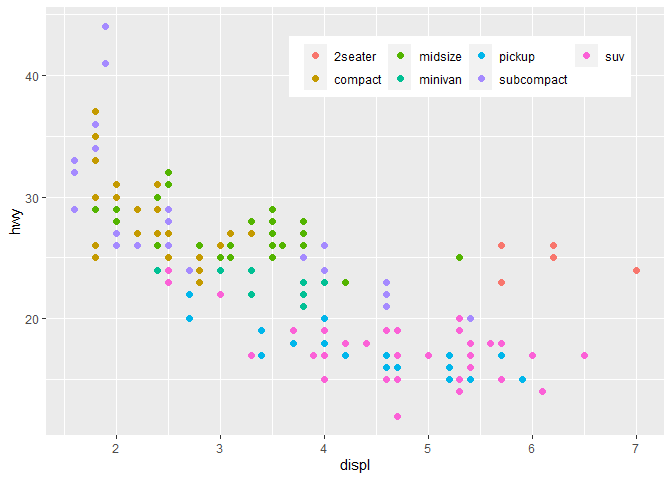
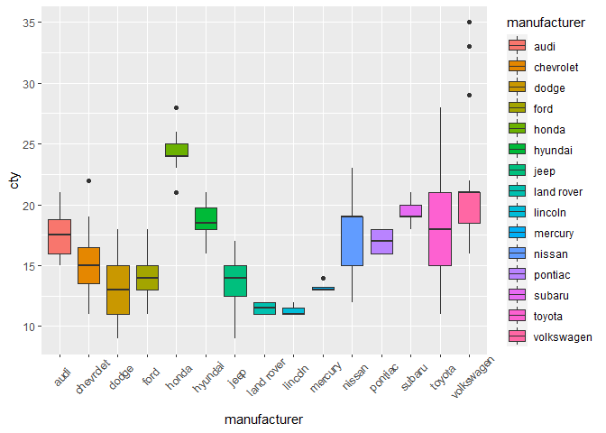

What went wrong?
================
Edited by Julia Shangguan

``` r
knitr::opts_chunk$set(echo = TRUE, error = TRUE)
```

## HW02 Part A

In this document, I try to fix the coding mistakes present in the
examples.

### I loaded in the necessary packages according to Robert’s instructions.

``` r
library("ggplot2")
library("magrittr") #so I can do some piping
```

### Graph Fail 1

``` r
data(mpg) #this is a dataset from the ggplot2 package

mpg %>% 
  ggplot(mapping = aes(x = city, y = hwy, color = "blue")) %>% 
  geom_point()
```

    ## Error: `mapping` must be created by `aes()`
    ## Did you use %>% instead of +?

**Graph 1 Answer:** If you want to use ‘mapping’, it should be created
by the aes function. I provided two different solutions, one that uses
“mapping” and another that is more streamlined in which I directly
called the dataset (“mpg”) within the ggplot function. In both
solutions, I added the geom\_point layer with a (“+”) to the ggplot
function. Additionally, when I called str(mpg), I see that “city”
doesn’t exist, so I am assuming that “cty” was actually meant.

*Graph 1 Solution \#1*

``` r
#library("ggplot2") #loaded library 
str(mpg) #checking the dataframes's structure
```

    ## tibble [234 × 11] (S3: tbl_df/tbl/data.frame)
    ##  $ manufacturer: chr [1:234] "audi" "audi" "audi" "audi" ...
    ##  $ model       : chr [1:234] "a4" "a4" "a4" "a4" ...
    ##  $ displ       : num [1:234] 1.8 1.8 2 2 2.8 2.8 3.1 1.8 1.8 2 ...
    ##  $ year        : int [1:234] 1999 1999 2008 2008 1999 1999 2008 1999 1999 2008 ...
    ##  $ cyl         : int [1:234] 4 4 4 4 6 6 6 4 4 4 ...
    ##  $ trans       : chr [1:234] "auto(l5)" "manual(m5)" "manual(m6)" "auto(av)" ...
    ##  $ drv         : chr [1:234] "f" "f" "f" "f" ...
    ##  $ cty         : int [1:234] 18 21 20 21 16 18 18 18 16 20 ...
    ##  $ hwy         : int [1:234] 29 29 31 30 26 26 27 26 25 28 ...
    ##  $ fl          : chr [1:234] "p" "p" "p" "p" ...
    ##  $ class       : chr [1:234] "compact" "compact" "compact" "compact" ...

``` r
ggplot(data = mpg) +
  geom_point(mapping = aes(x = cty, y = hwy, color = "blue")) 
```

<!-- -->

*Graph 1 Solution \#2*

``` r
ggplot(mpg, aes(x = cty, y = hwy, color = "blue")) + geom_point()
```

<!-- -->

### Graph Fail 2

``` r
ggplot(data = mpg) + 
  geom_point(mapping = aes(x = displ, y = hwy, color = "blue"))
```

<!-- -->

**Graph 2 Answer:** If you want to change the color of the points, the
“color” argument should be outside the aes function. You assign
variables to “color” within the aes function if you want to change the
color of the graph according to levels of that variable.

*Graph 2 Solution*

``` r
ggplot(data = mpg) + 
  geom_point(mapping = aes(x = displ, y = hwy), color = "blue")
```

<!-- -->

### Graph Fail 3

``` r
mpg %>% 
ggplot() + 
  geom_point(mapping = aes(x = displ, y = hwy, color = class), alpha = 2) + 
  theme(legend.direction = "horizontal") + 
  theme(legend.position = c(5, 40))
```

<!-- -->

**Graph 3 Answer:** Alpha changes the opacity. Setting alpha = 2 doesn’t
do anything because 100% opacity is already reached at alpha = 1. To
increase point size, use the argument “size”. Furthermore, to move the
legend, use the theme function and the legend.position() argument.
c(x,y) cannot be greater than (1,1) because (1,1) specifies the top
right location of the graph. To remove elements from the graph, set
“element\_blank()” in theme() elements; see below. To remove the
legend entirely, add layer: theme(legend.position = “none”)

*Graph 3 Solution*

``` r
mpg %>% 
ggplot() + 
  geom_point(mapping = aes(x = displ, y = hwy, color = class), size = 2) + 
  theme(legend.direction = "horizontal") + 
  theme(legend.position = c(0.6, .8), legend.title=element_blank()) 
```

<!-- -->

``` r
  # + theme(legend.position = "none") #to remove legend
```

### Graph Fail 4

``` r
mpg %>% 
ggplot(mapping = aes(x = displ, y = hwy, color = drv)) + 
  geom_point() + 
  geom_smooth(se = F) #se = F makes it so it won't show the error in the line of fit
```

    ## `geom_smooth()` using method = 'loess' and formula 'y ~ x'

<!-- -->

**Graph 4 Answer:** Geom\_smooth is creating a line for each level of
“drv” because the data has been grouped by drv levels. If just one
line is wanted for all the data points, remove the color argument.

*Graph 4 Solution*

``` r
mpg %>% 
ggplot(mapping = aes(x = displ, y = hwy)) + 
  geom_point() + 
  geom_smooth(se = F) 
```

    ## `geom_smooth()` using method = 'loess' and formula 'y ~ x'

<!-- -->

### Graph Fail 5

``` r
ggplot(data = mpg, mapping = aes(x = manufacturer, y = cty, color = manufacturer)) + 
  geom_boxplot() + 
  theme(axis.text.x = element_text(angle = 45))
```

<!-- -->

**Graph 5 Answer:** To make the box one color, use the “fill” argument.
To move the axis label, I used argument “vjust” to increase spacing
between the x labels and ticks.

*Graph 5 Solution*

``` r
ggplot(data = mpg, mapping = aes(x = manufacturer, y = cty, fill = manufacturer)) + 
  geom_boxplot() + 
  theme(axis.text.x = element_text(angle = 45, vjust = 0.5))
```

<!-- -->
