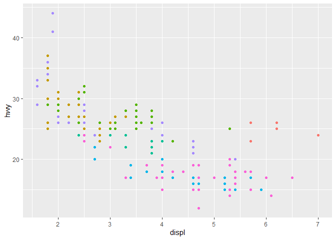

What went wrong?
================
Monty Kwan edits

``` r
knitr::opts_chunk$set(echo = TRUE, error = TRUE)
```

## HW02 Part A

In this document, I will add some examples of some coding mistakes, it
is up to you to figure out why the graphs are messing up.

### First load packages

It is always best to load the packages you need at the top of a script.
It’s another common coding formatting standard (like using the
assignment operator instead of the equals sign). In this case, it helps
people realize what they need to install for the script and gives an
idea of what functions will be called.

It is also best coding practice to only call the packages you use, so if
you use a package but end up tossing the code you use for it, then make
sure to remove loading it in the first place. For example, I could use
`library("tidyverse")` but since this script will only be using ggplot2,
I only load ggplot2.

``` r
library("ggplot2")
library("magrittr") #so I can do some piping
```

### Graph Fail 1

What error is being thrown? How do you correct it? (hint, the error
message tells you)

``` r
data(mpg) #this is a dataset from the ggplot2 package

mpg %>% 
  ggplot(mapping = aes(x = city, y = hwy, color = "blue")) %>% 
  geom_point()
```

    ## Error: `mapping` must be created by `aes()`
    ## Did you use %>% instead of +?

**My answer: This code *pipes* the first layer of the graph into the
‘geom\_point’ layer, which is wrong. Instead, we need to use ‘+’ to
*add* the ‘geom\_point’ layer to the graph. Also, look at the data
columns in data(mpg), and ‘city’ is spelled ‘cty’ so this needs to be
adjusted in the aes(x=cty). Are *data* = mpg and *mapping* = aes
necessary in the code??**

#### My corrected graph 1:

``` r
data(mpg) #this is a dataset from the ggplot2 package

ggplot(mpg, aes(x = cty, y = hwy, color = "blue")) +
  geom_point()
```

<!-- -->

### Graph Fail 2

Why aren’t the points blue? It is making me blue that the points in the
graph aren’t blue :\`(

``` r
ggplot(data = mpg) + 
  geom_point(mapping = aes(x = displ, y = hwy, color = "blue"))
```

<!-- -->
<br>**My answer: To change the color of the ‘geom\_point’ layer, the
‘aes’ can’t include the ‘color’ attribute *inside* the ( ). If the
‘color’ attribute is defined within the aesthetic, ggplot will think
‘color’ is a feature of a variable. The ‘color’ needs to be defined in
‘geom\_point’.**

#### My corrected graph 2:

``` r
ggplot(data = mpg) + 
  geom_point(mapping = aes(x = displ, y = hwy), color = "blue")
```

<!-- -->
<br> Either code works

``` r
ggplot(mpg, aes(x=displ, y=hwy)) + 
  geom_point(color="blue")
```

<!-- -->

### Graph Fail 3

Two mistakes in this graph. First, I wanted to make the the points
slightly bolder, but changing the alpha to 2 does nothing. What does
alpha do and what does setting it to 2 do? What could be done instead if
I want the points slightly bigger?

<br>**My answer: Alpha (has values between 0-1, where 0=invisible and
1=darkest) that controls transparency of points in ‘geom\_point’, for
example. Setting alpha to 2 would not do anything more than setting it
to 1. To make the points slightly bigger, the ‘size’ aesthetic can bet
set as an argument within ‘geom\_point’.**

Second, I wanted to move the legend on top of the graph since there
aren’t any points there, putting it at approximately the point/ordered
pair (5, 40). How do you actually do this? Also, how do you remove the
legend title (“class”)? Finally, how would you remove the plot legend
completely?

<br>**My answer: To change stylistic elements of a plot, call ‘theme()’
and change ‘legend.position’ using ‘c(x, y)’, where ‘c(0, 0)’ means
bottom-left of the coordinate plane and ‘c(0,1)’ means top-right. To
remove the legend title (“class”), use the ‘element\_blank()’ function
in a theme layer: theme(legend.title=element\_blank()). To remove the
plot legend completely: theme(legend.position=“none”). Alternatively,
would theme(legend.position=element\_blank()) also work??**

``` r
mpg %>% 
ggplot() + 
  geom_point(mapping = aes(x = displ, y = hwy, color = class), alpha = 2) + 
  theme(legend.direction = "horizontal") + 
  theme(legend.position = c(5, 40))
```

<!-- -->

#### My corrected graph 3:

``` r
mpg %>% 
ggplot() + 
  geom_point(mapping = aes(x = displ, y = hwy, color = class), size = 3) + 
  theme(legend.direction = "horizontal") + 
  theme(legend.position = c(.6, .8)) +
  theme(legend.title = element_blank())
```

<!-- -->

### Graph Fail 4

I wanted just one smoothing line. Just one line, to show the general
relationship here. But that’s not happening. Instead I’m getting 3
lines, why and fix it please?

<br>**My answer: Since ‘color=drv’ is defined within the ggplot
function, it is applied to all layers of the graph, including the
smoothing lines. To tell ggplot you don’t want the lines to be affected
by the different categories of ‘drv’, it should only be defined within
‘geom\_point’**

``` r
mpg %>% 
ggplot(mapping = aes(x = displ, y = hwy, color = drv)) + 
  geom_point() + 
  geom_smooth(se = F,) #se = F makes it so it won't show the error in the line of fit
```

    ## `geom_smooth()` using method = 'loess' and formula 'y ~ x'

<!-- -->

#### My corrected graph 4:

``` r
mpg %>% 
ggplot(mapping = aes(x = displ, y = hwy)) + 
  geom_point(mapping=aes(color = drv)) + 
  geom_smooth(se = F, color="yellow") #se = F makes it so it won't show the error in the line of fit
```

    ## `geom_smooth()` using method = 'loess' and formula 'y ~ x'

<!-- -->

### Graph Fail 5

I got tired of the points, so I went to boxplots instead. However, I
wanted the boxes to be all one color, but setting the color aesthetic
just changed the outline? How can I make the box one color, not just the
outline? <br>**My answer: ‘color’ only gives instructions for the
outline, but ‘fill’ defines the fill color of the box. Not sure how to
make all the boxes the same color??**

Also, the x-axis labels were overlaping, so I rotated them. But now they
overlap the bottom of the graph. How can I fix this so axis labels
aren’t on the graph? <br> **My answer: To adjust the positioning of
the x-axis title, add vjust (for vertical justification from 0-1).**

``` r
ggplot(data = mpg, mapping = aes(x = manufacturer, y = cty, color = manufacturer)) + 
  geom_boxplot() + 
  theme(axis.text.x = element_text(angle = 45))
```

<!-- -->

#### My corrected graph 5:

``` r
ggplot(data = mpg, mapping = aes(x = manufacturer, y = cty, fill=manufacturer)) + 
  geom_boxplot() + 
  theme(axis.text.x = element_text(angle = 45, vjust=0.5))
```

<!-- -->
