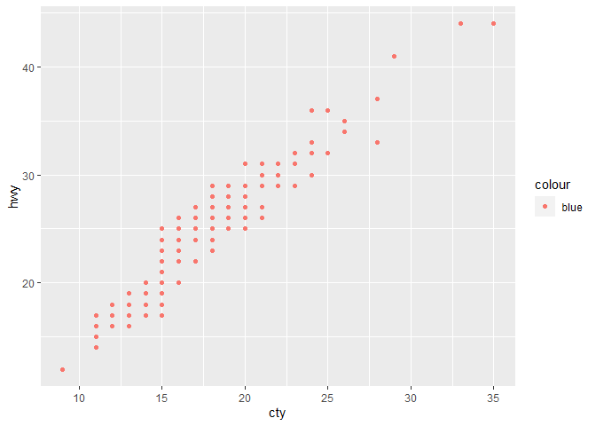

What went wrong?
================
Patrick Haller

``` r
knitr::opts_chunk$set(echo = TRUE, error = TRUE)
```

## HW02 Part A

In this document, I will add some examples of some coding mistakes, it
is up to you to figure out why the graphs are messing up.

### First load packages

It is always best to load the packages you need at the top of a script.
It’s another common coding formatting standard (like using the
assignment operator instead of the equals sign). In this case, it helps
people realize what they need to install for the script and gives an
idea of what functions will be called.

It is also best coding practice to only call the packages you use, so if
you use a package but end up tossing the code you use for it, then make
sure to remove loading it in the first place. For example, I could use
`library("tidyverse")` but since this script will only be using ggplot2,
I only load ggplot2.

``` r
library("ggplot2")
library("magrittr") #so I can do some piping
```

### Graph Fail 1

What error is being thrown? How do you correct it? (hint, the error
message tells you)

### Answer Graph Fail 1

**The error message essentially tells us that we need to replace the
`%>%` symbol after the `ggplot()` function with a `+`. With the `%>%`,
the `ggplot()` function would have been piped into the `geom_point()`
layer. However, we want to add the `geom_point()` layer to the
`ggplot()` function and this should be done by adding a `+`.**  
**Furthermore, we also have to define the x-variable as *cty* instead of
*city***

### New Graph 1

``` r
data(mpg) #this is a dataset from the ggplot2 package

mpg %>% 
  ggplot(mapping = aes(x = cty, y = hwy, color = "blue")) + 
  geom_point()
```

<!-- -->

### Graph Fail 2

Why aren’t the points blue? It is making me blue that the points in the
graph aren’t blue :\`(

``` r
ggplot(data = mpg) + 
  geom_point(mapping = aes(x = displ, y = hwy, color = "blue"))
```

<!-- -->

### Answer Graph Fail 2

**Here, the `color` argument is inside the `aes()` function and blue is
interpreted as a separate variable, not the color of the points. To
change the color of the points, the `color` argument has to be moved
outside of the `aes()` function into the `geom_point()` layer.**

### New Graph 2

``` r
ggplot(data = mpg) + 
  geom_point(mapping = aes(x = displ, y = hwy), color = "blue")
```

<!-- -->

### Graph Fail 3

Two mistakes in this graph. First, I wanted to make the the points
slightly bolder, but changing the alpha to 2 does nothing. What does
alpha do and what does setting it to 2 do? What could be done instead if
I want the points slightly bigger?

Second, I wanted to move the legend on top of the graph since there
aren’t any points there, putting it at approximately the point/ordered
pair (5, 40). How do you actually do this? Also, how do you remove the
legend title (“class”)? Finally, how would you remove the plot legend
completely?

``` r
mpg %>% 
ggplot() + 
  geom_point(mapping = aes(x = displ, y = hwy, color = class), alpha = 2) + 
  theme(legend.direction = "horizontal") + 
  theme(legend.position = c(5, 40))
```

<!-- -->

### Answer Graph Fail 3

**The `alpha` argument can be used to adjust the transparency of the
`geom_point()` layer. In ggplot, it is treated as a continuous variable
that ranges from 0 to 1, with 0 being completely transparent and 1 being
completely opaque. It seems that setting alpha equal to 2 does not
change the appearance of the `geom_point()` layer, so I’m guessing that
since 2 is outside the range of possible alpha values, it is just
replaced by the default alpha value (which is 1)? Either way, to
increase the point size, the `alpha` argument should be replaced by the
`size` argument.**

**The legend can be placed on top of the graph manually by adjusting the
x and y coordinates in `theme(legend.position = c(x, y))`. Here, the
values for x and y have to be between 0 and 1, with `c(0, 0)` being the
bottom left corner of the graph, and `c(1, 1)` being the top right
corner. In our case here, I found that setting `c(0.6, 0.8)` gives a
pretty nice result. The legend title specifically can be removed by
adding a separate theme layer, indicating that the legend title should
be a blank element: `theme(legend.title = element_blank())`. Lastly, to
remove the legend completely, a new theme layer should be added:
`theme(legend.position = “none”)`**

### New Graph 3

``` r
mpg %>% 
ggplot() + 
  geom_point(mapping = aes(x = displ, y = hwy, color = class), size = 2) +
  theme(legend.direction = "horizontal") +
  theme(legend.position = c(0.6, 0.8)) + 
  theme(legend.title = element_blank())
```

<!-- -->

### Graph Fail 4

I wanted just one smoothing line. Just one line, to show the general
relationship here. But that’s not happening. Instead I’m getting 3
lines, why and fix it please?

``` r
mpg %>% 
ggplot(mapping = aes(x = displ, y = hwy, color = drv)) + 
  geom_point() + 
  geom_smooth(se = F) #se = F makes it so it won't show the error in the line of fit
```

    ## `geom_smooth()` using method = 'loess' and formula 'y ~ x'

<!-- -->

### Answer Graph Fail 4

**Because the color argument here is inside the `ggplot()` function,
each color is being treated as a separate group, and the `geom_smooth()`
layer was applied to each group individually. This created three
smoothing lines. To prevent this from happening, we can place `set color
equal to drv`color = drv`inside
the`geom\_point()`layer:`geom\_point(aes(color = drv))`. This way,
the`geom\_smooth()\` layer doesn’t treat each color as a separate group,
and only one smoothing line is produced.**

### New Graph 4

``` r
mpg %>% 
ggplot(mapping = aes(x = displ, y = hwy)) + 
  geom_point(aes(color = drv)) + 
  geom_smooth(se = F) #se = F makes it so it won't show the error in the line of fit
```

    ## `geom_smooth()` using method = 'loess' and formula 'y ~ x'

<!-- -->

### Graph Fail 5

I got tired of the points, so I went to boxplots instead. However, I
wanted the boxes to be all one color, but setting the color aesthetic
just changed the outline? How can I make the box one color, not just the
outline?

Also, the x-axis labels were overlaping, so I rotated them. But now they
overlap the bottom of the graph. How can I fix this so axis labels
aren’t on the
graph?

``` r
ggplot(data = mpg, mapping = aes(x = manufacturer, y = cty, color = manufacturer)) + 
  geom_boxplot() + 
  theme(axis.text.x = element_text(angle = 45))
```

<!-- -->

### Answer Graph Fail 5

**The `color` argument only applies color to the outline of the boxes.
To fill in the boxes, it has to be changed to the `fill` argument.**  
**To prevent the x-axis labels from overlapping the bottom of the graph,
we can adjust the height of the x-axis labels by specifying the hjust
argument inside `theme(axis.text.x = element_text(angle = 45, hjust
= 1))`. I found that setting hjust equal to one seems to solve the
problem.**

### New Graph 5

``` r
ggplot(data = mpg, mapping = aes(x = manufacturer, y = cty, fill = manufacturer)) + 
  geom_boxplot() + 
  theme(axis.text.x = element_text(angle = 45, hjust = 1))  
```

<!-- -->
