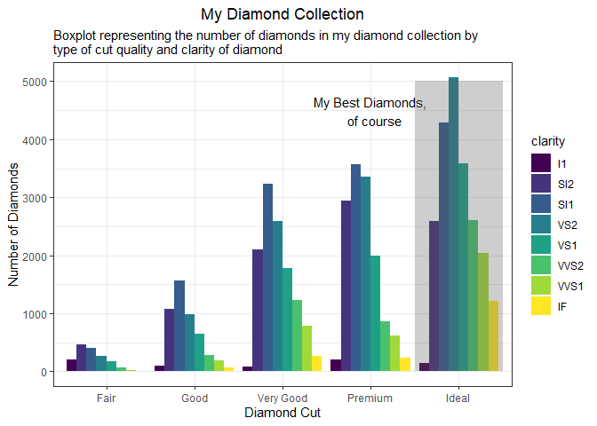
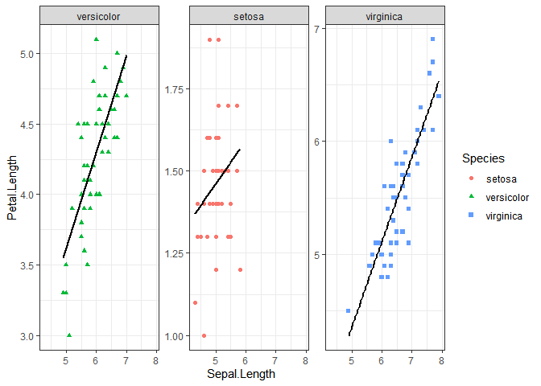
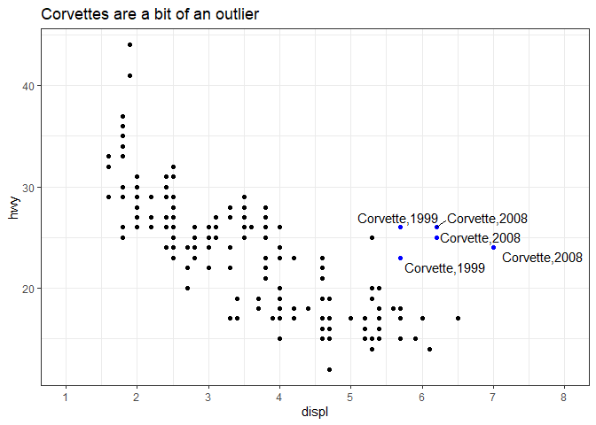
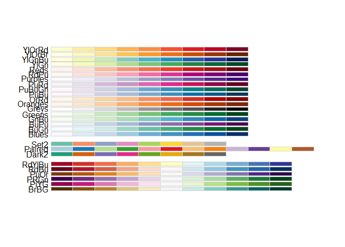
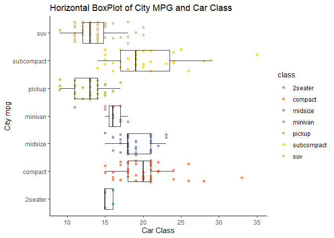

HW02\_B\_Graph-Mimic
================
Robert Gruener

``` r
library("ggplot2")
library("magrittr") #so I can do some piping
data("diamonds")
data("mpg")
data("iris")
theme_set(theme_bw()) #I'll give you this one, you can set the theme individually for graphs
#or you can set the theme for all the graphs using theme_set()
#theme_bw() is best theme (IMO)

#for graph 3:
library("ggrepel")
```

## HW02 Part B

For this part of the HW, the goal is to try to recreate the graphs I
make from scratch. I will only provide the MD, not the actual code I
used to create it besides which data I use to create it. The rest will
be up to you.

Try for all 4, but if you are struggling don’t worry about it. Try your
best for each, if you don’t get everything that’s what the peer-review
is for. :smile:

### Graph 1

``` r
data("diamonds")
#hint think about the *position* the bars are in...
```

Using the diamonds dataset, make this graph:
<!-- -->

``` r
diamonds %>% 
  ggplot(aes(x = cut, fill = clarity)) +
  geom_bar(stat = "count", position = "dodge") + # stat argument allows for the y axis to count total number of cases #default of position is #stack, which is not what we want. Dodge will create this staggered looking bar plot
  labs(title = "My Diamond Collection", subtitle = "Boxplot representing the number of diamonds in my diamond collection by \ntype of cut quality and clarity of diamond", x = "Diamond Cut", y = "Number of Diamonds") + # using " \n " causes a line break in the subtitle
  theme(plot.title = element_text(hjust = 0.5, size = 20), plot.subtitle = element_text(size = 16))
#I am struggling to add the rectangle and text over the "Ideal" bars - any advice?
```

### Graph 2

``` r
data("iris")
```

Using the iris dataset, make this graph:

    ## `geom_smooth()` using formula 'y ~ x'

<!-- -->

``` r
iris %>% 
  ggplot(aes(Sepal.Length, Petal.Length, color = Species, shape = Species)) +
  geom_point() +
  facet_wrap(vars(Species), scales = "free_y") + #I tried using scales with facet_grid() first and it did not work. I wonder why?
  geom_smooth(method = "lm",formula = y ~ x, se = FALSE, color = "black") #method = loess (which is the default) does not give the desired line,
#so I changed it to something that did. Do I understand why? No
#I am also not sure how to reorder the species. the "versicolor" facet need to be swapped with the "setosa"
```

### Graph 3

You’ll need the information in this first box to create the graph

``` r
data("mpg")
corvette <- mpg[mpg$model == "corvette",]
#install
require("ggrepel") #useful for making text annotations better, hint hint
set.seed(42)
```

Now using the mpg dataset and the corvette dataset, make this graph:

<!-- -->

There is a trick to getting the model and year to print off together.
`paste()` is a useful function for this, also pasting together parts of
file names and parts of urls together.

``` r
mpg %>% 
  ggplot(aes(displ, hwy)) +
  geom_point(color = ifelse(mpg$hwy > 22 & mpg$displ > 5.5, "blue", "black")) + #ifelse() allows for only the outliers to be highlighted in blue
  geom_text_repel(data = corvette, aes(label = paste(model, year, sep = ",")), segment.alpha = 0) +
  labs(title = "Corvettes are a bit of an outlier")
#Not sure how to force "corvette" to be capitalized
```

### Graph 4

``` r
data(mpg)

#hint for the coloring, colorbrewer and you can set palette colors and make your graphs colorblind friendly
library(RColorBrewer)
display.brewer.all(colorblindFriendly = T) #take a look at the colorblindfriendly options
```

<!-- -->

The above graph lets you see some colobrlind friendly palettes. For the
graph below, I used Set2.

Now using the above mpg dataset, make this graph

<!-- -->

``` r
mpg %>% 
  ggplot(aes(x = class, y = cty)) +
  geom_jitter(aes(fill = class, color = class), height = 0) + #This specific jitter will only allow for the vertical movement of the dots, mimicing what is seen in the example
  geom_boxplot(alpha = 0) + #alpha() is important to see points through boxes
  coord_flip() + #to make the boxplot horizontal
  theme(
    panel.grid.major = element_blank(), panel.grid.minor = element_blank(),
    panel.border = element_blank(),
    axis.line = element_line(color = "black") # This creates the theme without gridlines and the non-axis borders (would this be a good object to save for future use?)
    ) +
  labs(title = "Horizontal BoxPlot of City MPG and Car Class",
       x = "Car Class", y = "City mpg") +
  scale_color_brewer(palette = "Set2") # COlorblind palette
```