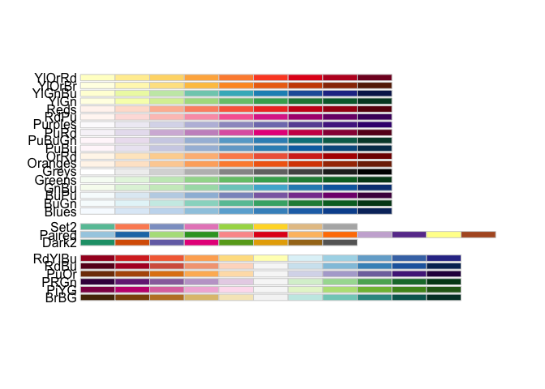

HW02\_B\_Graph-Mimic
================
Viola Nawrocka

``` r
library("ggplot2")
library("magrittr") #so I can do some piping
data("diamonds")
data("mpg")
data("iris")
theme_set(theme_bw()) #I'll give you this one, you can set the theme individually for graphs
#or you can set the theme for all the graphs using theme_set()
#theme_bw() is best theme (IMO)

#for graph 3:
library("ggrepel")
```

## HW02 Part B

### Graph 1

``` r
data("diamonds")

diamonds %>% 
  ggplot(mapping = aes(x = cut, fill = clarity)) +
  geom_bar(position = position_dodge(width = 0.9)) +
  labs(
      title = "My Diamond Collection",
      subtitle = "Boxplot representing the number of diamonds in my diamond collection by \ntype of cut quality and clarity of diamond",
      x = "Diamond Cut",
      y = "Number of Diamonds"
  ) +
  theme(plot.title = element_text(hjust = 0.5)) +
  annotate("text", x = "Premium", y = 4500, label = "My Best Diamonds, \n of course") +
  annotate ("rect", xmin = 4.5, xmax = 5.5, ymin = 0, ymax = 5000, hjust = "Ideal", fill = "grey40", alpha = 0.3)
```

    ## Warning: Ignoring unknown parameters: hjust

<!-- -->

### Graph 2

``` r
data("iris")
```

``` r
data("iris")


iris %>% 
  ggplot(mapping = aes(x = Sepal.Length, y = Petal.Length, color = Species)) +
  geom_point() +
  geom_smooth(method= lm, se = F, color = "black") +
  facet_wrap(~ Species, scales = "free_y")
```

    ## `geom_smooth()` using formula 'y ~ x'

<!-- -->

### Graph 3

``` r
data("mpg")
corvette <- mpg[mpg$model == "corvette",]
#install
require("ggrepel") #useful for making text annotations better, hint hint
set.seed(42)
```

``` r
#Replacing "corvette" with "Corvette".

mpg$model[mpg$model == "corvette"] <- "Corvette"
mpg
```

    ## # A tibble: 234 x 11
    ##    manufacturer model    displ  year   cyl trans   drv     cty   hwy fl    class
    ##    <chr>        <chr>    <dbl> <int> <int> <chr>   <chr> <int> <int> <chr> <chr>
    ##  1 audi         a4         1.8  1999     4 auto(l… f        18    29 p     comp…
    ##  2 audi         a4         1.8  1999     4 manual… f        21    29 p     comp…
    ##  3 audi         a4         2    2008     4 manual… f        20    31 p     comp…
    ##  4 audi         a4         2    2008     4 auto(a… f        21    30 p     comp…
    ##  5 audi         a4         2.8  1999     6 auto(l… f        16    26 p     comp…
    ##  6 audi         a4         2.8  1999     6 manual… f        18    26 p     comp…
    ##  7 audi         a4         3.1  2008     6 auto(a… f        18    27 p     comp…
    ##  8 audi         a4 quat…   1.8  1999     4 manual… 4        18    26 p     comp…
    ##  9 audi         a4 quat…   1.8  1999     4 auto(l… 4        16    25 p     comp…
    ## 10 audi         a4 quat…   2    2008     4 manual… 4        20    28 p     comp…
    ## # … with 224 more rows

``` r
ggplot(mpg, aes(x=displ, y=hwy)) +
  
  geom_point(aes(x=displ, y=hwy), color = "black") +
  geom_point(data=mpg[24:28, ], colour="blue") +
  xlim(1,8) +
  
#Initially tried to use: nudge_x=0.2, nudge_y=-2, but that would only let me move the labels by the same amount in x and y directions, so I decided to switch to annotate, since there were only 5 labels to add (not that much work really).
  
  annotate("text", x = 6.35, y = 22, label = "Corvette, 1999") +
  annotate("text", x = 7.7, y = 23, label = "Corvette, 2008") +
  annotate("text", x = 6.85, y = 25, label = "Corvette, 2008") +
  annotate("text", x = 6.95, y = 27, label = "Corvette, 2008") +
  annotate("text", x = 5.7, y = 27, label = "Corvette, 1999") +
  annotate("segment", x = 6.22, xend = 6.36, y = 26.15, yend = 26.8, colour = "black", size = 0.4) +
  
  labs(
    title="Corvettes are a bit of an outlier"
  )  
```

<!-- -->

### Palette for Graph 4

``` r
data(mpg)

#hint for the coloring, colorbrewer and you can set palette colors and make your graphs colorblind friendly
library(RColorBrewer)
display.brewer.all(colorblindFriendly = T) #take a look at the colorblindfriendly options
```

<!-- -->

### Graph 4

``` r
ggplot(mpg, aes(x=class, y=cty)) +

  
  geom_boxplot(outlier.shape=NA) +
  
  #Add points to the plot and add some jitter to counter the overplotting.
  geom_point(aes(color=class), size=1.5, position = position_jitter(w = 0.4, h = 0)) +

  #Set the color.
  scale_color_brewer(palette = "Set2") +
  
  #Flip axes.
  coord_flip() +
  
  #Add the title and labels to the axes.
  labs(x = "City mpg", y = "Car Class", title = "Horizontal BoxPlot of City MPG and Car Class") +
  
  theme(
    panel.grid.major = element_blank(), 
    panel.grid.minor = element_blank(), 
    panel.border = element_blank(),
    axis.line = element_line(colour = "black")
    ) +
  
  theme(
    plot.title=element_text(face='bold', colour="black")
    )
```

<!-- -->
