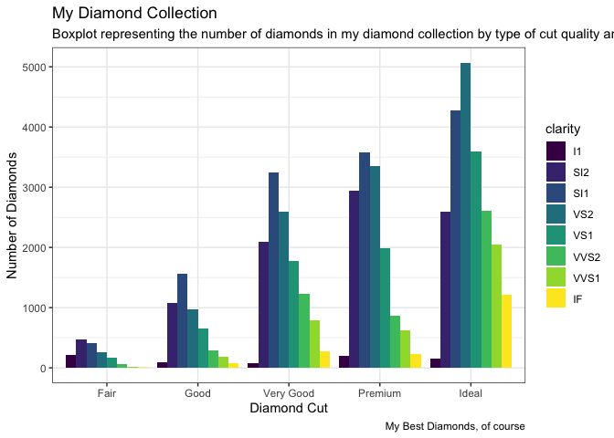

HW02\_B\_Graph-Mimic
================
Julia Shangguan

```{r setup, include=FALSE}
knitr::opts_chunk$set(echo = FALSE)
```
``` r
library("ggplot2")
library("magrittr") 
data("diamonds")
data("mpg")
data("iris")
theme_set(theme_bw()) 
library("ggrepel")
```

## HW02 Part B

### Graph 1

``` r
ggplot(diamonds, aes(x = cut, fill = clarity)) +
  geom_bar(position = "dodge") + 
  annotate("rect", xmin = 4.5, xmax = 5.5, ymin = 0, ymax = 5000,fill = "black", alpha = 0.2) +
  annotate("text", x = 4, y = 4500, label = "My Best Diamonds,\nof course") +
  theme_bw() +
  xlab("Diamond Cut") +
  ylab("Number of Diamonds") +
  labs(title = "My Diamond Collection", subtitle = "Boxplot representing the number of diamonds in my diamond collection by\ntype of cut quality and clarity of diamond") +
  theme(plot.title = element_text(hjust = 0.5)) 
```

<!-- -->

### Graph 2

``` r
data("iris")
```

Using the iris dataset, make this graph:

### Graph 3

You’ll need the information in this first box to create the graph

``` r
data("mpg")
corvette <- mpg[mpg$model == "corvette",]
#install
require("ggrepel") #useful for making text annotations better, hint hint
set.seed(42)
```

Now using the mpg dataset and the corvette dataset, make this graph:

There is a trick to getting the model and year to print off together.
`paste()` is a useful function for this, also pasting together parts of
file names and parts of urls together.

### Graph 4

``` r
data(mpg)

#hint for the coloring, colorbrewer and you can set palette colors and make your graphs colorblind friendly
library(RColorBrewer)
display.brewer.all(colorblindFriendly = T) #take a look at the colorblindfriendly options
```

<!-- -->

The above graph lets you see some colobrlind friendly palettes. For the
graph below, I used Set2.

Now using the above mpg dataset, make this graph
