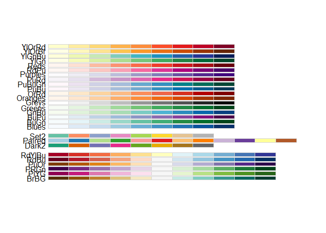

HW02\_B\_Graph-Mimic
================
Andrea Watson

## HW02 Part B

``` r
library("ggplot2")
library("magrittr")
data("diamonds")
data("mpg")
data("iris")
theme_set(theme_bw())

#for graph 3:
library("ggrepel")
```

### Graph 1

``` r
data("diamonds")
```

``` r
diamonds %>% 
  ggplot(mapping = aes(x = cut, fill = clarity)) +
  geom_bar(position = "dodge")  +
  ggtitle(label = "My Diamond Collection", subtitle = "Boxplot representing the number of diamonds in my diamond collection by\ntype of cut quality and clarity of diamond") + 
  theme(plot.title = element_text(hjust = 0.5)) +
  xlab("Diamond Cut") +
  ylab("Number of Diamonds") +
  annotate("rect", xmin=4.5, xmax=5.5, ymin=0, ymax=5000, alpha=0.25) +
  annotate("text", x = 4, y = 4500, label = "My Best Diamonds,\n of course")
```

<!-- -->

### Graph 2

``` r
data("iris")
```

``` r
iris$Species <- factor(iris$Species, levels = c("versicolor", "setosa", "virginica"))

# The above changes the order to matchthe example, but I can't figure out how to have the correct colors and shapes for the correct groups.

iris %>%
  ggplot(mapping = aes(x = Sepal.Length, y = Petal.Length, color = Species, shape = Species)) +
  geom_point() +
  facet_wrap(~Species, scales="free_y") +
  geom_smooth(method="lm", se=FALSE, color = "black")
```

<!-- -->

### Graph 3

``` r
data("mpg")
corvette <- mpg[mpg$model == "corvette",]
#install
require("ggrepel") #useful for making text annotations better, hint hint
set.seed(42)
```

``` r
mpg$model_year <- paste(paste(toupper(substr(mpg$model, 1,1)), substr(mpg$model, 2, 8), sep=""), mpg$year, sep = ",")

mpg_corvette <- mpg %>% 
             subset(model=="corvette")

mpg %>% 
  ggplot(mapping = aes(x = displ, y = hwy)) +
  geom_point() +
  geom_point(data = mpg_corvette, color="blue") +
  geom_text_repel(data = mpg_corvette, aes(label=model_year)) +
  ggtitle("Corvettes are a bit of an outlier") +
  scale_x_continuous(limits = c(1,8), breaks = seq(1, 8, by = 1))
```

<!-- -->

### Graph 4

``` r
data(mpg)

library(RColorBrewer)
display.brewer.all(colorblindFriendly = T)
```

<!-- -->

``` r
mpg %>%
  ggplot(mapping = aes(x = class, y = cty)) +
  geom_point(aes(color = class)) +
  geom_boxplot(alpha=0) +
  coord_flip() +
  scale_colour_manual(values=brewer.pal(7, "Set2")) +
  ggtitle("Horizontal BoxPlot of City MPG and Car Class") +
  ylab("Car Class") +
  xlab("City mpg")
```

<!-- -->
